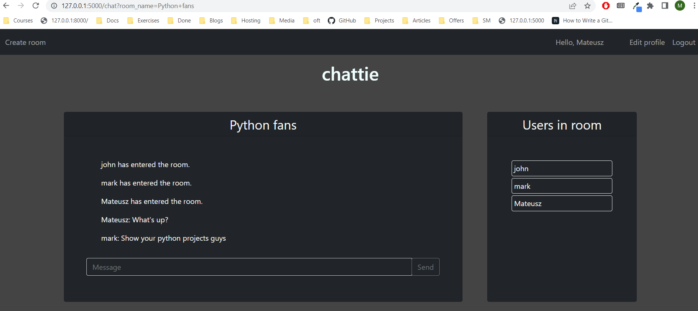

# Chattie

## Table of contents
* [General info](#general-info)
* [Technologies](#technologies)
* [Features](#features)
* [Setup](#setup)

## General info

Chat app created in flask for learning purpose. My main focus was to create my first flask app and learn pytest.

## Technologies

 - Python
 - Flask
 - Pytest
 - Factory-boy
 - JavaScript
 - Postgreql
 - Heroku

## Features

 - chat room CRUD
 - dynamic sending messages
 - dynamic user list in app and room
 - Register, login, change and reset password
 - Separate setting for environments
 - update profile pic
 - tested in pytest

Unfortunately, due to free heroku slowness dynamic features may not work as intended there :(

## Potencially to do

 - add docker and CI/CD
 - sending pics and gifs
 - guest login
 - infinite scroll in area with room messages
 - permissions, bans etc.
 - searching users and rooms
 - updating and deleting messages
 - private messages
 - pagination
 - some REST API views

 ## Setup 

Clone repo `git clone https://github.com/MateuszM-M/chattie-app-flask`,

Rename chattie/config/`.env-example` to `.env`

create venv and enter it `python -m venv venv`, `venv\scripts\activate`

assign FLASK_APP env var `set FLASK_APP=run.py`, 

create db and test user `flask main create_db`

run app `python run.py` or `flask run`

Browse http://127.0.0.1:5000/

Or

Online demo: http://chattie-app-flask.herokuapp.com/